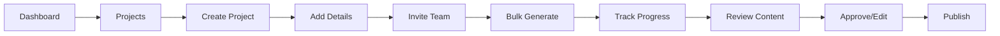

# SEO Content Generation System - UI/UX Specification

## 1. Executive Summary

This document outlines the comprehensive UI/UX design specifications for the SEO Content Generation System. The design focuses on creating an intuitive, professional interface that simplifies complex SEO processes while delivering enterprise-grade functionality. Our design philosophy emphasizes one-click simplicity, progressive disclosure of advanced features, and real-time feedback throughout the content generation process.

### Design Principles
- **Simplicity First**: Core functionality accessible with minimal clicks
- **Progressive Disclosure**: Advanced features revealed as needed
- **Real-Time Feedback**: Continuous progress indicators and live updates
- **Professional Aesthetics**: Clean, modern design conveying expertise
- **Accessibility**: WCAG AA compliance throughout
- **Performance**: Fast, responsive interactions across all devices

## 2. User Personas & Journey Maps

### Primary Personas

#### 1. Content Creator "Sarah"
- **Role**: Freelance content writer
- **Goals**: Generate high-quality SEO content quickly
- **Pain Points**: Manual keyword research, optimization complexity
- **Tech Level**: Intermediate
- **Key Features**: One-click generation, content editor, export options

#### 2. Agency Manager "Michael"
- **Role**: Digital marketing agency owner
- **Goals**: Manage multiple client projects efficiently
- **Pain Points**: Team collaboration, client reporting
- **Tech Level**: Advanced
- **Key Features**: Project management, team access, bulk generation

#### 3. Small Business Owner "Lisa"
- **Role**: E-commerce store owner
- **Goals**: Create product descriptions and blog content
- **Pain Points**: Limited SEO knowledge, time constraints
- **Tech Level**: Beginner
- **Key Features**: Templates, guided workflow, CMS integration

### User Journey Map

```
Discovery → Onboarding → First Content → Regular Use → Advanced Features
    |           |             |              |                |
Sign Up → Tutorial → Generate → Optimize → Scale
```

## 3. Information Architecture

### Site Map

```
├── Landing Page (Public)
├── Auth Pages
│   ├── Login
│   ├── Register
│   ├── Reset Password
│   └── Email Verification
├── Dashboard (Protected)
│   ├── Overview
│   ├── Quick Actions
│   ├── Recent Content
│   └── Usage Statistics
├── Content Generation
│   ├── New Content
│   │   ├── Keyword Input
│   │   ├── Location Selection
│   │   ├── Advanced Settings
│   │   └── Generation Progress
│   ├── Content Editor
│   │   ├── Rich Text Editor
│   │   ├── SEO Optimization Panel
│   │   ├── Preview Mode
│   │   └── Export Options
│   └── Content History
├── Projects
│   ├── All Projects
│   ├── Create Project
│   ├── Project Details
│   └── Team Management
├── Analytics
│   ├── Performance Dashboard
│   ├── Content Rankings
│   ├── Traffic Analytics
│   └── ROI Calculator
├── Account
│   ├── Profile Settings
│   ├── Subscription & Billing
│   ├── API Keys
│   └── Team Members
└── Support
    ├── Documentation
    ├── Tutorials
    └── Contact Support
```

## 4. User Flows

### Primary Flow: Content Generation

```mermaid
graph LR
    A[Dashboard] --> B[New Content]
    B --> C[Enter Keyword]
    C --> D[Select Location]
    D --> E[Choose Settings]
    E --> F[Start Generation]
    F --> G[Progress View]
    G --> H[Analysis Phase]
    H --> I[Generation Phase]
    I --> J[Content Editor]
    J --> K[Optimize/Edit]
    K --> L[Export/Publish]
```



### Secondary Flow: Project Management



## 5. Wireframes & Layout Specifications

### Dashboard Layout

```
┌─────────────────────────────────────────────────────────────────┐
│ Header: Logo | Navigation | User Menu | Subscription Status     │
├─────────────────────────────────────────────────────────────────┤
│                                                                 │
│  Welcome Section                                               │
│  ┌─────────────┐  ┌─────────────┐  ┌─────────────┐           │
│  │ Quick Start │  │ Usage Stats │  │ Recent Work │           │
│  │             │  │             │  │             │           │
│  │ [Generate]  │  │ 15/50 Used  │  │ • Blog Post │           │
│  │             │  │ [Upgrade]   │  │ • Product   │           │
│  └─────────────┘  └─────────────┘  └─────────────┘           │
│                                                                 │
│  Recent Content Grid                                           │
│  ┌─────────┐ ┌─────────┐ ┌─────────┐ ┌─────────┐            │
│  │ Content │ │ Content │ │ Content │ │ Content │            │
│  │ Card 1  │ │ Card 2  │ │ Card 3  │ │ Card 4  │            │
│  └─────────┘ └─────────┘ └─────────┘ └─────────┘            │
│                                                                 │
│  Performance Overview                                          │
│  ┌─────────────────────────────────────────────┐             │
│  │ Chart: Content Performance Over Time         │             │
│  └─────────────────────────────────────────────┘             │
└─────────────────────────────────────────────────────────────────┘
```

### Content Generation Interface

```
┌─────────────────────────────────────────────────────────────────┐
│ Header: Back to Dashboard | Save Draft | Help                  │
├─────────────────────────────────────────────────────────────────┤
│                                                                 │
│  Step 1: Basic Information                                     │
│  ┌─────────────────────────────────────────────┐             │
│  │ Target Keyword: [___________________]       │             │
│  │                                             │             │
│  │ Target Location: [Dropdown: USA ▼]         │             │
│  │                                             │             │
│  │ Content Type: ( ) Blog Post                │             │
│  │               (•) Service Page              │             │
│  │               ( ) Product Description       │             │
│  └─────────────────────────────────────────────┘             │
│                                                                 │
│  Advanced Settings [▼ Expand]                                  │
│                                                                 │
│  ┌─────────────────────────────────────────────┐             │
│  │          [Generate Content]                  │             │
│  └─────────────────────────────────────────────┘             │
│                                                                 │
└─────────────────────────────────────────────────────────────────┘
```

### Content Editor Layout

```
┌─────────────────────────────────────────────────────────────────┐
│ Toolbar: Save | Undo/Redo | Format Options | Export | Preview  │
├─────────────────────────────────────────────────────────────────┤
│                                     │                           │
│  Content Editor                     │  SEO Optimization Panel  │
│  ┌─────────────────────────────┐  │  ┌────────────────────┐  │
│  │                             │  │  │ SEO Score: 94/100  │  │
│  │  Rich Text Editor          │  │  │                    │  │
│  │                             │  │  │ Keyword Density:   │  │
│  │  H1: [Title Here]          │  │  │ Primary: 1.2%      │  │
│  │                             │  │  │ LSI: ✓ Optimized   │  │
│  │  Content paragraphs...      │  │  │                    │  │
│  │                             │  │  │ Readability: Good  │  │
│  │                             │  │  │                    │  │
│  │                             │  │  │ Suggestions:       │  │
│  │                             │  │  │ • Add keyword to   │  │
│  │                             │  │  │   H2 heading       │  │
│  └─────────────────────────────┘  │  └────────────────────┘  │
│                                     │                           │
└─────────────────────────────────────────────────────────────────┘
```

## 6. Visual Design System

### Color Palette

#### Primary Colors
- **Primary Blue**: #2563EB (Main CTAs, links, active states)
- **Primary Dark**: #1E40AF (Hover states, emphasis)
- **Primary Light**: #DBEAFE (Backgrounds, subtle highlights)

#### Neutral Colors
- **Gray 900**: #111827 (Primary text)
- **Gray 700**: #374151 (Secondary text)
- **Gray 500**: #6B7280 (Tertiary text, placeholders)
- **Gray 300**: #D1D5DB (Borders, dividers)
- **Gray 100**: #F3F4F6 (Backgrounds)
- **White**: #FFFFFF (Cards, primary backgrounds)

#### Semantic Colors
- **Success**: #10B981 (Positive feedback, completed states)
- **Warning**: #F59E0B (Warnings, cautions)
- **Error**: #EF4444 (Errors, destructive actions)
- **Info**: #3B82F6 (Information, tips)

### Typography

#### Font Stack
```css
font-family: -apple-system, BlinkMacSystemFont, "Segoe UI", Roboto, 
             "Helvetica Neue", Arial, sans-serif;
```

#### Type Scale
- **Display**: 48px/56px, -0.02em tracking, 700 weight
- **H1**: 36px/44px, -0.02em tracking, 700 weight
- **H2**: 30px/38px, -0.01em tracking, 600 weight
- **H3**: 24px/32px, -0.01em tracking, 600 weight
- **H4**: 20px/28px, 0em tracking, 600 weight
- **Body Large**: 18px/28px, 0em tracking, 400 weight
- **Body**: 16px/24px, 0em tracking, 400 weight
- **Body Small**: 14px/20px, 0em tracking, 400 weight
- **Caption**: 12px/16px, 0.01em tracking, 400 weight

### Spacing System

Based on 8px grid:
- **xs**: 4px
- **sm**: 8px
- **md**: 16px
- **lg**: 24px
- **xl**: 32px
- **2xl**: 48px
- **3xl**: 64px

### Component Specifications

#### Buttons

**Primary Button**
```css
background: #2563EB;
color: #FFFFFF;
padding: 12px 24px;
border-radius: 8px;
font-weight: 600;
font-size: 16px;
transition: all 0.2s ease;
hover: background: #1E40AF;
active: transform: scale(0.98);
disabled: opacity: 0.5, cursor: not-allowed;
```

**Secondary Button**
```css
background: #FFFFFF;
color: #2563EB;
border: 2px solid #2563EB;
padding: 10px 22px;
/* Other properties same as primary */
```

**Ghost Button**
```css
background: transparent;
color: #374151;
padding: 12px 24px;
hover: background: #F3F4F6;
```

#### Form Elements

**Input Fields**
```css
border: 1px solid #D1D5DB;
border-radius: 8px;
padding: 12px 16px;
font-size: 16px;
background: #FFFFFF;
focus: border-color: #2563EB, box-shadow: 0 0 0 3px rgba(37,99,235,0.1);
error: border-color: #EF4444;
```

**Labels**
```css
font-size: 14px;
font-weight: 500;
color: #374151;
margin-bottom: 6px;
```

#### Cards

```css
background: #FFFFFF;
border-radius: 12px;
box-shadow: 0 1px 3px rgba(0,0,0,0.1);
padding: 24px;
hover: box-shadow: 0 4px 12px rgba(0,0,0,0.15);
```

### Icons & Imagery

#### Icon Library
- **Primary**: Heroicons (Outline for navigation, Solid for actions)
- **Size Guidelines**: 
  - Navigation: 24px
  - Inline: 20px
  - Small: 16px

#### Icon Usage
- Always pair with text labels for accessibility
- Use consistent stroke width (2px)
- Maintain 8px minimum touch target padding

## 7. Interaction Design

### Micro-interactions

#### Button States
- **Default**: Base styling
- **Hover**: Darker shade, cursor pointer
- **Active**: Scale down 2%, darker shade
- **Disabled**: 50% opacity, cursor not-allowed
- **Loading**: Spinner icon, disabled state

#### Form Feedback
- **Focus**: Blue outline with soft shadow
- **Valid**: Green checkmark icon, success border
- **Invalid**: Red X icon, error border, helper text
- **Loading**: Skeleton loader or spinner

### Animations

#### Page Transitions
```css
transition: opacity 0.2s ease-in-out;
animation: fadeIn 0.3s ease-out;
```

#### Content Loading
```css
@keyframes pulse {
  0%, 100% { opacity: 1; }
  50% { opacity: 0.5; }
}
animation: pulse 2s cubic-bezier(0.4, 0, 0.6, 1) infinite;
```

#### Progress Indicators
- Linear progress bar for determinate processes
- Circular spinner for indeterminate loading
- Step indicators for multi-stage processes

### Loading States

#### Skeleton Screens
- Use for initial page loads
- Match content layout structure
- Animate with subtle pulse effect

#### Progress Tracking
```
Analysis Stage:
[████████░░░░░░░] 50% - Analyzing competitor content...

Generation Stage:
[████████████░░░] 80% - Generating optimized content...
```

## 8. Responsive Design

### Breakpoints

```css
/* Mobile First Approach */
sm: 640px   /* Small tablets */
md: 768px   /* Tablets */
lg: 1024px  /* Desktop */
xl: 1280px  /* Large desktop */
2xl: 1536px /* Extra large */
```

### Mobile Adaptations

#### Navigation
- Hamburger menu for mobile
- Bottom tab bar for primary actions
- Swipe gestures for navigation

#### Content Generation
- Full-screen step-by-step wizard
- Collapsible advanced options
- Touch-optimized inputs

#### Editor
- Simplified toolbar
- Swipeable SEO panel
- Full-screen editing mode

### Touch Targets
- Minimum 44x44px for all interactive elements
- 8px minimum spacing between targets
- Larger targets for primary actions

## 9. Accessibility Specifications

### WCAG AA Compliance

#### Color Contrast
- Normal text: 4.5:1 minimum
- Large text: 3:1 minimum
- UI components: 3:1 minimum
- Use tools to verify all color combinations

#### Keyboard Navigation
- All interactive elements keyboard accessible
- Visible focus indicators
- Logical tab order
- Skip links for main content

#### Screen Reader Support
- Semantic HTML structure
- ARIA labels for complex components
- Live regions for dynamic updates
- Alternative text for all images

### Accessibility Features

```html
<!-- Example: Accessible Button -->
<button 
  type="button"
  aria-label="Generate SEO content"
  aria-pressed="false"
  aria-describedby="generation-help"
>
  <span aria-hidden="true">🚀</span>
  Generate Content
</button>
<span id="generation-help" class="sr-only">
  Click to start generating SEO-optimized content
</span>
```

## 10. Component Library

### Navigation Components

#### Header Navigation
```jsx
<Header>
  <Logo />
  <NavMenu>
    <NavItem href="/dashboard">Dashboard</NavItem>
    <NavItem href="/content">Content</NavItem>
    <NavItem href="/projects">Projects</NavItem>
    <NavItem href="/analytics">Analytics</NavItem>
  </NavMenu>
  <UserMenu>
    <SubscriptionBadge tier="pro" />
    <Avatar />
    <Dropdown />
  </UserMenu>
</Header>
```

#### Sidebar Navigation
```jsx
<Sidebar collapsed={isCollapsed}>
  <SidebarSection title="Content">
    <SidebarItem icon={PlusIcon} href="/content/new">
      New Content
    </SidebarItem>
    <SidebarItem icon={ClockIcon} href="/content/history">
      History
    </SidebarItem>
  </SidebarSection>
</Sidebar>
```

### Form Components

#### Keyword Input
```jsx
<FormField>
  <Label htmlFor="keyword">Target Keyword</Label>
  <Input
    id="keyword"
    type="text"
    placeholder="Enter your target keyword..."
    maxLength={100}
    showCharCount
    autoComplete="off"
  />
  <HelperText>
    Enter the main keyword you want to rank for
  </HelperText>
</FormField>
```

#### Location Selector
```jsx
<FormField>
  <Label htmlFor="location">Target Location</Label>
  <Select id="location" defaultValue="us">
    <SelectGroup label="Popular">
      <SelectItem value="us">United States</SelectItem>
      <SelectItem value="uk">United Kingdom</SelectItem>
      <SelectItem value="ca">Canada</SelectItem>
    </SelectGroup>
    <SelectGroup label="All Countries">
      {/* Full country list */}
    </SelectGroup>
  </Select>
</FormField>
```

### Content Components

#### Content Card
```jsx
<ContentCard>
  <ContentCard.Header>
    <ContentCard.Title>
      How to Optimize Your Website for SEO
    </ContentCard.Title>
    <ContentCard.Meta>
      <Badge>Blog Post</Badge>
      <span>2 hours ago</span>
    </ContentCard.Meta>
  </ContentCard.Header>
  <ContentCard.Stats>
    <Stat label="Words" value="2,451" />
    <Stat label="SEO Score" value="94/100" trend="up" />
    <Stat label="Keywords" value="12" />
  </ContentCard.Stats>
  <ContentCard.Actions>
    <Button variant="ghost" size="sm">Edit</Button>
    <Button variant="ghost" size="sm">Export</Button>
    <Button variant="ghost" size="sm">View Analytics</Button>
  </ContentCard.Actions>
</ContentCard>
```

#### Progress Indicator
```jsx
<ProgressCard>
  <ProgressCard.Header>
    <ProgressCard.Title>Generating Content</ProgressCard.Title>
    <ProgressCard.Time>~2 minutes remaining</ProgressCard.Time>
  </ProgressCard.Header>
  <ProgressCard.Steps>
    <Step status="completed">Analyzing competitors</Step>
    <Step status="active">Extracting SEO metrics</Step>
    <Step status="pending">Generating content</Step>
    <Step status="pending">Optimizing output</Step>
  </ProgressCard.Steps>
  <ProgressBar value={45} />
</ProgressCard>
```

### Feedback Components

#### Toast Notifications
```jsx
// Success
<Toast variant="success">
  <Toast.Icon>✓</Toast.Icon>
  <Toast.Content>
    <Toast.Title>Content Generated!</Toast.Title>
    <Toast.Description>
      Your SEO-optimized content is ready to edit
    </Toast.Description>
  </Toast.Content>
  <Toast.Action>View</Toast.Action>
</Toast>

// Error
<Toast variant="error">
  <Toast.Icon>!</Toast.Icon>
  <Toast.Content>
    <Toast.Title>Generation Failed</Toast.Title>
    <Toast.Description>
      API rate limit exceeded. Try again in 5 minutes.
    </Toast.Description>
  </Toast.Content>
  <Toast.Close />
</Toast>
```

#### Empty States
```jsx
<EmptyState>
  <EmptyState.Icon>
    <DocumentIcon />
  </EmptyState.Icon>
  <EmptyState.Title>No content yet</EmptyState.Title>
  <EmptyState.Description>
    Get started by generating your first SEO-optimized content
  </EmptyState.Description>
  <EmptyState.Action>
    <Button>Generate Content</Button>
  </EmptyState.Action>
</EmptyState>
```

## 11. Performance Optimization

### Frontend Performance

#### Code Splitting
```javascript
// Lazy load heavy components
const Editor = lazy(() => import('./components/Editor'));
const Analytics = lazy(() => import('./components/Analytics'));

// Route-based splitting
const routes = [
  {
    path: '/editor',
    component: lazy(() => import('./pages/Editor'))
  }
];
```

#### Image Optimization
- Use Next.js Image component
- Implement lazy loading
- Serve WebP format with fallbacks
- Use appropriate image sizes

#### Bundle Optimization
- Tree shaking unused code
- Minification and compression
- CDN for static assets
- Service worker for offline support

### Perceived Performance

#### Optimistic Updates
```javascript
// Update UI immediately, sync with server
const handleSave = async (content) => {
  // Update local state immediately
  setContent(content);
  setSaving(true);
  
  try {
    await api.saveContent(content);
  } catch (error) {
    // Rollback on error
    setContent(previousContent);
    showError('Failed to save');
  } finally {
    setSaving(false);
  }
};
```

#### Progressive Enhancement
- Core functionality works without JavaScript
- Enhanced features for modern browsers
- Graceful degradation for older browsers

## 12. Error States & Edge Cases

### Error Handling Patterns

#### Network Errors
```jsx
<ErrorBoundary>
  <ErrorState
    icon={<WifiOffIcon />}
    title="Connection Lost"
    description="Check your internet connection and try again"
    action={
      <Button onClick={retry}>Retry</Button>
    }
  />
</ErrorBoundary>
```

#### Validation Errors
```jsx
<FormField error={errors.keyword}>
  <Input 
    invalid={!!errors.keyword}
    aria-invalid={!!errors.keyword}
    aria-describedby="keyword-error"
  />
  {errors.keyword && (
    <ErrorMessage id="keyword-error">
      {errors.keyword}
    </ErrorMessage>
  )}
</FormField>
```

#### API Errors
- Rate limiting: Show countdown timer
- Server errors: Provide status page link
- Auth errors: Redirect to login
- Validation errors: Highlight specific fields

### Edge Cases

#### Long Content
- Implement pagination for lists
- Virtual scrolling for large datasets
- Truncation with "Show more" options

#### Slow Networks
- Show progress indicators
- Implement request timeouts
- Provide cancel options
- Cache previous results

#### Browser Compatibility
- Feature detection over browser detection
- Polyfills for essential features
- Fallback UI for unsupported features

## 13. Internationalization (i18n)

### Language Support
- English (primary)
- Spanish
- French
- German
- Portuguese

### Implementation
```javascript
// Using next-i18next
{
  "dashboard": {
    "title": "Dashboard",
    "welcome": "Welcome back, {{name}}",
    "generate": "Generate Content",
    "usage": "{{used}} of {{total}} credits used"
  }
}
```

### RTL Support
- Mirror layout for RTL languages
- Flip directional icons
- Adjust text alignment
- Update animations

### Localization Considerations
- Date/time formats
- Number formats
- Currency display
- Cultural color meanings

## 14. Testing & Quality Assurance

### Usability Testing

#### Test Scenarios
1. First-time user onboarding
2. Generate content with basic settings
3. Edit and optimize generated content
4. Manage multiple projects
5. Export content to CMS

#### Success Metrics
- Task completion rate > 95%
- Time to first content < 5 minutes
- Error rate < 2%
- User satisfaction > 4.5/5

### A/B Testing

#### Test Variations
- CTA button text and placement
- Onboarding flow steps
- Dashboard layout options
- Pricing page design

### Accessibility Testing
- Screen reader testing (NVDA, JAWS, VoiceOver)
- Keyboard navigation testing
- Color contrast validation
- Focus management testing

## 15. Design Handoff

### Design Tokens
```json
{
  "colors": {
    "primary": {
      "50": "#EFF6FF",
      "500": "#2563EB",
      "900": "#1E3A8A"
    }
  },
  "spacing": {
    "xs": "0.25rem",
    "sm": "0.5rem",
    "md": "1rem",
    "lg": "1.5rem",
    "xl": "2rem"
  },
  "typography": {
    "heading1": {
      "fontSize": "2.25rem",
      "lineHeight": "2.75rem",
      "fontWeight": 700
    }
  }
}
```

### Component Documentation

Each component should include:
- Component name and description
- Props/parameters
- Usage examples
- Do's and don'ts
- Accessibility notes
- Related components

### Asset Delivery
- SVG icons in icon sprite
- Image assets in multiple resolutions
- Font files (if custom fonts used)
- Brand guidelines document

## 16. Future Enhancements

### Phase 2 Features
- AI-powered content suggestions
- Collaborative editing
- Advanced analytics dashboard
- Chrome extension
- Mobile app

### Design Considerations
- Maintain consistency with Phase 1
- Progressive enhancement approach
- Backward compatibility
- User feedback integration

## Conclusion

This UI/UX specification provides a comprehensive blueprint for building an intuitive, professional, and accessible SEO content generation platform. The design balances simplicity for beginners with powerful features for advanced users, ensuring broad market appeal while maintaining high usability standards.

Key success factors:
- One-click content generation
- Real-time progress feedback
- Professional visual design
- Comprehensive accessibility
- Responsive across all devices
- Performance-optimized implementation

By following these specifications, the development team can create a user experience that not only meets functional requirements but delights users and drives business success.