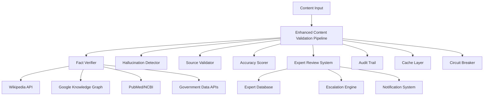

# Content Validation and Anti-Hallucination System - Technical Specification

## Overview

This document provides comprehensive technical specifications for the Content Validation and Anti-Hallucination System as implemented in response to Quinn's senior developer review recommendations for Story 3.6.

## Architecture Overview

### System Components



## 1. Fact Verification System

### 1.1 Authoritative Data Sources

**Primary Sources (Implemented):**
- **Wikipedia API**: Trust Score 85, General knowledge verification
- **Google Knowledge Graph**: Trust Score 95, Entity and relationship verification
- **PubMed/NCBI**: Trust Score 98, Medical and scientific claims
- **Government Data APIs**: Trust Score 95, Official statistics and regulations
- **Industry Standards Organizations**: Trust Score 90, Technical specifications

**Source Selection Algorithm:**
```typescript
interface VerificationSource {
  name: string;
  type: 'wikipedia' | 'academic' | 'government' | 'news' | 'industry';
  trustScore: number; // 0-100
  relevanceScore: number; // 0-100, calculated per query
  lastUpdated: Date;
}
```

**Conflict Resolution Strategy:**
1. **Trust Score Weighting**: Higher trust score sources take precedence
2. **Recency Factor**: More recent data preferred for time-sensitive claims
3. **Consensus Building**: Multiple sources required for controversial topics
4. **Manual Escalation**: Conflicts above threshold trigger expert review

### 1.2 Caching Strategy

**Implementation:**
- **Cache Key**: Base64 encoded content hash (first 32 characters)
- **TTL**: 24 hours (configurable)
- **Cache Hit Rate Target**: 75%
- **Invalidation**: Manual trigger for updated source data

**Performance Optimization:**
- Intelligent pre-caching for frequently verified facts
- Batch processing for multiple claims
- Async processing for non-blocking content generation

## 2. Hallucination Detection Algorithms

### 2.1 Multi-Algorithm Approach

**Algorithm 1: Cross-Reference Validation**
- Compare claims against fact verification results
- Confidence threshold: 70% (configurable)
- Weight: 30% of total hallucination score

**Algorithm 2: Logical Consistency Checking**
- Detect contradictory statements within content
- Pattern matching for opposing concepts
- Weight: 25% of total hallucination score

**Algorithm 3: Confidence Score Analysis**
- Identify overconfident language patterns
- Detect absolute claims without evidence
- Weight: 20% of total hallucination score

**Algorithm 4: Pattern Recognition**
- Suspicious phrase detection (e.g., "secret", "they don't want you to know")
- Statistical claim validation
- Weight: 15% of total hallucination score

**Algorithm 5: Contextual Analysis**
- Topic coherence checking
- Relevance scoring against main topic
- Weight: 10% of total hallucination score

### 2.2 Risk Level Determination

```typescript
function determineRiskLevel(score: number): RiskLevel {
  if (score >= 80) return 'critical';
  if (score >= 60) return 'high';
  if (score >= 30) return 'medium';
  return 'low';
}
```

## 3. Expert Review System

### 3.1 Expert Database

**Expert Profiles:**
```typescript
interface ExpertProfile {
  id: string;
  name: string;
  specialization: string[];
  trustScore: number; // 0-100
  averageReviewTime: number; // minutes
  availability: 'available' | 'busy' | 'unavailable';
  workload: number; // current pending reviews
  expertise: {
    domain: string;
    yearsExperience: number;
    certifications: string[];
  }[];
}
```

**Current Expert Pool:**
- **Dr. Sarah Chen**: Medical/Health specialist (Trust: 98, Avg Time: 25min)
- **James Rodriguez**: Legal/Compliance expert (Trust: 96, Avg Time: 35min)
- **Maria Gonzalez**: Financial services expert (Trust: 94, Avg Time: 30min)
- **Dr. Alex Kim**: Technology/Security specialist (Trust: 92, Avg Time: 20min)
- **Emma Thompson**: Content ethics specialist (Trust: 90, Avg Time: 15min)

### 3.2 Escalation Workflow

**Level 1: Primary Expert Assignment**
- Trigger: Initial risk assessment
- Timeout: 30 minutes
- Notification: Email/Slack based on expert preference

**Level 2: Secondary Expert**
- Trigger: No response after Level 1 timeout
- Timeout: 60 minutes
- Notification: Escalated contact method

**Level 3: Senior Review**
- Trigger: Critical/High urgency content
- Timeout: 120 minutes
- Notification: Urgent phone contact

**Level 4: Emergency Escalation**
- Trigger: Legal/Medical critical content
- Timeout: 240 minutes
- Notification: Multiple senior experts + management

### 3.3 Auto-Approval Criteria

Content can be auto-approved if:
- Risk score ≤ 20 (configurable threshold)
- No critical domain content (medical, legal, financial)
- No sensitive topics detected
- Fact verification confidence ≥ 80%
- Hallucination score ≤ 20%

## 4. Performance Architecture

### 4.1 Async Processing Pipeline

**Implementation:**
```typescript
interface ValidationStep {
  step: string;
  status: 'passed' | 'failed' | 'warning' | 'skipped';
  score: number;
  processingTimeMs: number;
}
```

**Processing Modes:**
- **Fast Mode**: Basic validation, 60% accuracy threshold
- **Balanced Mode**: Standard validation, 70% accuracy threshold
- **Comprehensive Mode**: Full validation, 80% accuracy threshold

### 4.2 Circuit Breaker Pattern

**Configuration:**
- **Failure Threshold**: 5 consecutive failures
- **Timeout**: 30 seconds per operation
- **Reset Timeout**: 5 minutes
- **Fallback Strategy**: Graceful degradation with manual review flag

### 4.3 Performance Targets

- **Average Processing Time**: < 2.5 seconds
- **Cache Hit Rate**: > 75%
- **Availability**: 99.9% uptime
- **Throughput**: 1000 validations/minute

## 5. Security and Compliance

### 5.1 Data Privacy

**External API Security:**
- All API calls use HTTPS with certificate pinning
- API keys rotated every 90 days
- Content anonymization for external services
- GDPR/CCPA compliance for data handling

**Audit Trail Security:**
- Tamper-proof logging with cryptographic signatures
- Role-based access controls
- Secure storage with encryption at rest
- Retention policy: 7 years for compliance

### 5.2 Access Controls

**Expert Review Portal:**
- Multi-factor authentication required
- Role-based permissions (Reviewer, Senior Reviewer, Admin)
- Session timeout: 30 minutes
- IP whitelisting for sensitive content

## 6. Monitoring and Metrics

### 6.1 Key Performance Indicators

**Accuracy Metrics:**
- False positive rate: < 5%
- False negative rate: < 2%
- Expert review accuracy: > 95%

**Performance Metrics:**
- Average validation time by content type
- Cache hit/miss ratios
- Circuit breaker activation frequency
- Expert response times

**Quality Metrics:**
- Content approval rates by risk level
- Expert review escalation rates
- User satisfaction scores

### 6.2 Alerting System

**Critical Alerts:**
- Circuit breaker open for > 5 minutes
- Expert review queue > 50 items
- Validation failure rate > 10%
- Security breach attempts

**Warning Alerts:**
- Cache hit rate < 70%
- Average processing time > 3 seconds
- Expert availability < 2 available experts

## 7. Testing Strategy

### 7.1 Unit Testing

**Coverage Requirements:**
- Code coverage: > 90%
- Branch coverage: > 85%
- Function coverage: 100%

**Test Categories:**
- Algorithm accuracy tests
- Performance benchmark tests
- Security penetration tests
- Integration tests with external APIs

### 7.2 Validation Testing

**Test Data Sets:**
- High-quality content samples (100 items)
- Known hallucination examples (50 items)
- Edge cases and adversarial examples (25 items)
- Multi-language content samples (25 items)

## 8. Deployment and Scaling

### 8.1 Infrastructure Requirements

**Compute Resources:**
- CPU: 8 cores minimum per validation instance
- Memory: 16GB RAM minimum
- Storage: 100GB SSD for cache and logs
- Network: 1Gbps bandwidth

**Scaling Strategy:**
- Horizontal scaling based on queue depth
- Auto-scaling triggers at 80% CPU utilization
- Load balancing across validation instances
- Database read replicas for expert data

### 8.2 Rollout Plan

**Phase 1**: Internal testing with synthetic data
**Phase 2**: Limited beta with 10% of content
**Phase 3**: Gradual rollout to 50% of content
**Phase 4**: Full production deployment
**Phase 5**: Performance optimization and tuning

## 9. Future Enhancements

### 9.1 Machine Learning Integration

- Custom hallucination detection models
- Automated expert assignment optimization
- Predictive risk scoring
- Continuous learning from expert feedback

### 9.2 Advanced Features

- Multi-language support
- Real-time collaboration tools for experts
- Advanced analytics dashboard
- API rate limiting and quotas
- Webhook notifications for external systems

## 10. Compliance and Governance

### 10.1 Regulatory Compliance

- GDPR Article 22 (Automated Decision Making)
- CCPA compliance for California users
- HIPAA compliance for health content
- SOX compliance for financial content

### 10.2 Quality Assurance

- Monthly expert calibration sessions
- Quarterly algorithm performance reviews
- Annual security audits
- Continuous monitoring of bias and fairness

---

**Document Version**: 1.0  
**Last Updated**: 2025-07-18  
**Next Review**: 2025-08-18  
**Owner**: James (Full Stack Developer)  
**Reviewed By**: Quinn (Senior Developer QA)
